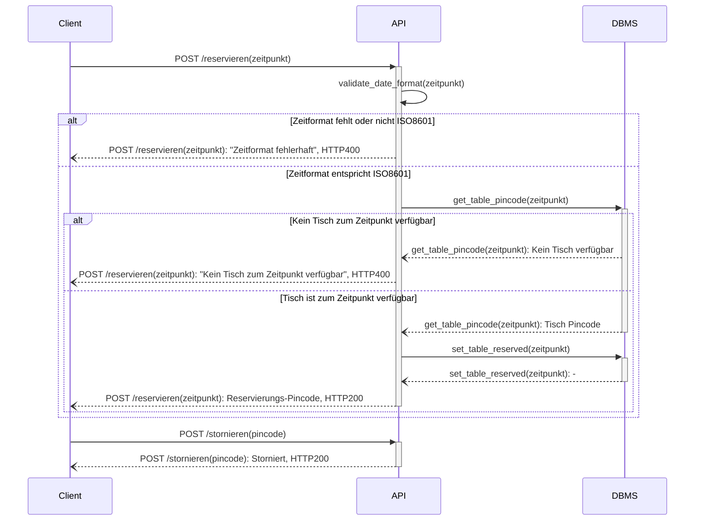

# Sequenz-Diagramm

```mermaid
sequenceDiagram
    participant Client
    participant API
    participant DBMS

    Client->>+API: POST /reservieren(zeitpunkt)

    API->>API: validate_date_format(zeitpunkt)
    alt Zeitformat fehlt oder nicht ISO8601
        API--)Client: POST /reservieren(zeitpunkt): "Zeitformat fehlerhaft", HTTP400

    else Zeitformat entspricht ISO8601
        API->>+DBMS: get_table_pincode(zeitpunkt)
        alt Kein Tisch zum Zeitpunkt verfügbar
            DBMS--)API: get_table_pincode(zeitpunkt): Kein Tisch verfügbar
            API--)Client: POST /reservieren(zeitpunkt): "Kein Tisch zum Zeitpunkt verfügbar", HTTP400

        else Tisch ist zum Zeitpunkt verfügbar
            DBMS--)-API: get_table_pincode(zeitpunkt): Tisch Pincode
            API->>+DBMS: set_table_reserved(zeitpunkt)
            DBMS--)-API: set_table_reserved(zeitpunkt): -
            API--)-Client: POST /reservieren(zeitpunkt): Reservierungs-Pincode, HTTP200

        end

    end

    Client->>+API: POST /stornieren(pincode)

    API--)-Client: POST /stornieren(pincode): Storniert, HTTP200
```